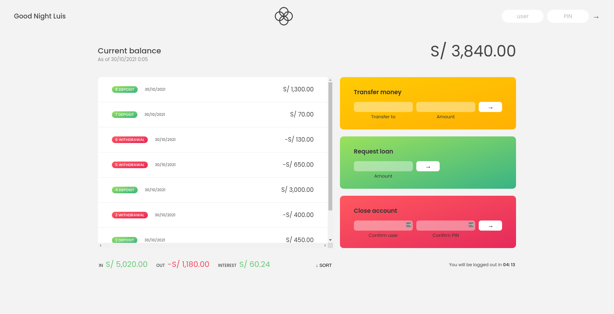

# 🎦Bankist 

JavaScript project, a webpage for a fictional bank where the clients can check their account balance, request a loan and transfer money.
## ⚙️Features
- Fake sign-in up to four accounts
|lc |1111 |
| ------ | ------ |
| fm| 2222|
|stw|3333|
|ss|4444|
- Visualize all the user's movements 
- Transfer money to any of the other 3 user's accounts 
- Request loans
## 🚀DEMO
Request a loan and maybe transfer some money to a close friend on [Bankist](https://luiscadillo.github.io/Bankist/ "website")
## 👀Preview

